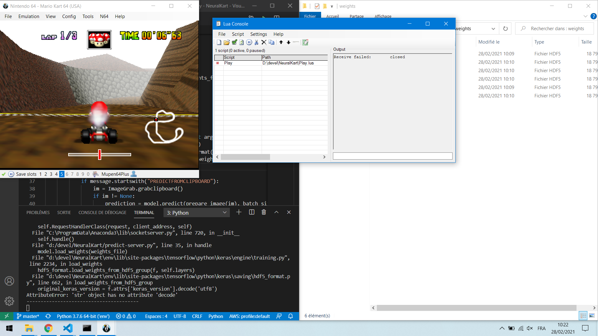

# marioKartAI
AI plays Mario Kart

The full training workflow in [marioKartAI.ipynb](marioKartAI.ipynb) is based on [behavioural-cloning](https://github.com/slevin48/behavioural-cloning)


<!--  -->

Inspired by [TensorKart](https://github.com/kevinhughes27/TensorKart) for training and [NeuralKart](https://github.com/rameshvarun/NeuralKart) for inference while playing

Scripts:
- [record.py](scripts/record.py)
- [utils.py](scripts/utils.py)
    - load_sample
    - viewer
    - prepare
    - ...
- [train.py](scripts/train.py)
- [play.py](scripts/play.py)
- [debugging.ipynb](scripts/debugging.ipynb)

## Record

Define `OFFSET_Y = 60` in `utils.py`


Use [DS4windows.exe](http://ds4windows.com/) to recognize PS4 controller as Xbox controller on Windows

## Viewer

[TensorKart](https://github.com/kevinhughes27/TensorKart) viewer

Run `python utils.py viewer samples` to view the samples (stored at the root of the samples folder)


## Prepare

Run `python utils.py prepare samples/*` with an array of sample directories to build an `X` and `y` matrix for training. (zsh will expand samples/* to all the directories. Passing a glob directly also works)

`X` is a 3-Dimensional array of images

`y` is the expected joystick ouput as an array:

```
  [0] joystick x axis
  [1] joystick y axis
  [2] button a
  [3] button b
  [4] button rb
```

## Train AI

The Deep Learning model used is the one from NVIDIA in this famous [paper](https://arxiv.org/pdf/1604.07316.pdf) from 2016:


The `train.py` program will train a model using Google's TensorFlow framework and cuDNN for GPU acceleration. 

It takes ~1 min to train 474 samples on 30 epochs (~3 mins for 100 epochs)


## AI Playing

Almost there... WIP


Leveraging **NeuralKart** [Play.lua](play/Play.lua) script and [predict-server.py](play/predict-server.py) for inference

### Joystick control / emulator
* [Pygame tuto #user-input](https://realpython.com/pygame-a-primer/#user-input)
* [pygame.joystick](https://www.pygame.org/docs/ref/joystick.html)
* [pygame.key](https://www.pygame.org/docs/ref/key.html)
* [joystick](https://pypi.org/project/joystick/): Real-time plotting and logging while console controlling
* [PYXInput](https://github.com/bayangan1991/PYXInput): emulating xbox controllers on Windows as well as reading the state of controllers using standard xinput (MIT License)


[Simulate XBox Controller Input with Python](https://stackoverflow.com/questions/43483121/simulate-xbox-controller-input-with-python)

* [vJoy](http://vjoystick.sourceforge.net/site/): SDK and driver to simulate input devices
* [pyVJoy](https://github.com/tidzo/pyvjoy): access these drivers and simulate the input inside python
* [x360ce](https://www.x360ce.com/) xbox 360 controller emulation

Example: [pygta/vjoy-testing](https://github.com/Sentdex/pygta5/tree/master/vjoy-testing)


### h5py error

Apparently h5py >= 3 results in the [following problem](https://github.com/tensorflow/tensorflow/issues/44467)([stackoverflow thread](https://stackoverflow.com/questions/53740577/does-any-one-got-attributeerror-str-object-has-no-attribute-decode-whi)):
```
AttributeError: 'str' object has no attribute 'decode'
```

To solve it:
`pip install h5py==2.10.0 --user`



### clipboard error

`OSError: failed to open clipboard`

Solved by replacing `im = ImageGrab.grabclipboard()` line 38 of [Play.lua](https://github.com/rameshvarun/NeuralKart/blob/master/Play.lua) 
with `try ... except`:

```
try:
    im = ImageGrab.grabclipboard()
except:
    print("failed to open clipboard")
```


## Sources

* [TensorKart](https://github.com/kevinhughes27/TensorKart)
    * [Autopilot-TensorFlow](https://github.com/SullyChen/Autopilot-TensorFlow)
* [NeuralKart](https://github.com/rameshvarun/NeuralKart)
* [NEAT Mario Kart 64](https://github.com/nicknlsn/MarioKart64NEAT)
* [BizHawk](https://github.com/TASVideos/BizHawk)
    * [Super Mario Kart ROM](https://www.emulatorgames.net/roms/super-nintendo/super-mario-kart/)
    * [Mario Kart 64 ROM](https://wowroms.com/en/roms/nintendo-64/mario-kart-64-usa/24662.html)
* MariFlow
    * [download](https://sethbling.s3-us-west-2.amazonaws.com/Downloads/MariFlow.zip)
    * [doc](https://docs.google.com/document/d/1p4ZOtziLmhf0jPbZTTaFxSKdYqE91dYcTNqTVdd6es4/edit#)
* [MarIQ](https://sethbling.s3-us-west-2.amazonaws.com/Downloads/MarIQ.zip)
    * [download](https://sethbling.s3-us-west-2.amazonaws.com/Downloads/MarIQ.zip)
    * [doc](https://docs.google.com/document/d/1uxzeSMqj56YGWh8LkzfNriuGvA3aWU3olg-MSCgWuSI/edit)


